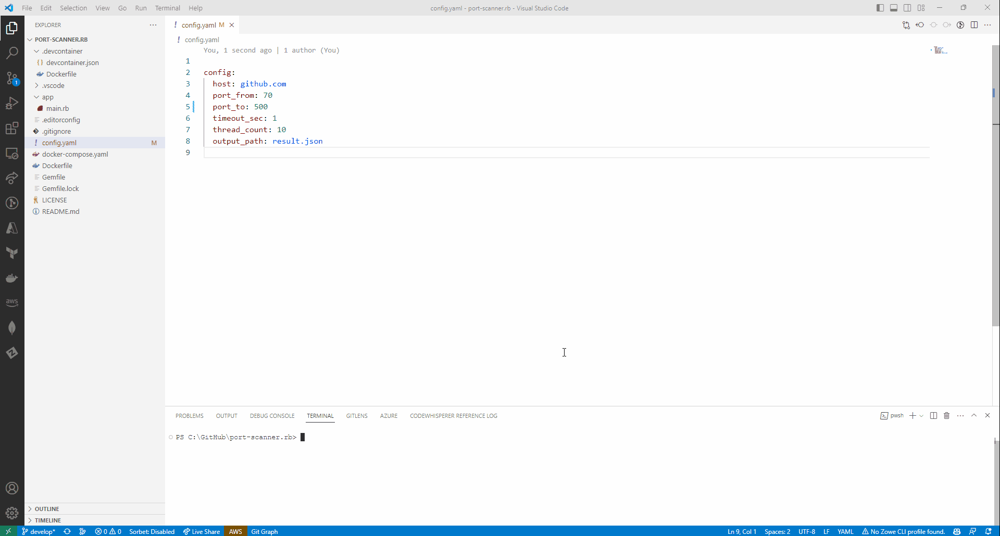

# port-scanner.rb

🦐🦐🦐 Rubyでポートスキャンを行うスクリプトです。  

  

## 実行方法

以下のコマンドを実行してください。  

```shell
docker compose up app -d [--build]
```

設定ファイル(config.yaml)を編集して、ポートスキャンの設定を変更してください。  
実行後は`result.json`(デフォルト)に結果が出力されます。  

---

DevContainerに入って直接実行することもできます。  
この場合は以下のコマンドを実行してください。  

```shell
ruby ./app/main.rb
```
